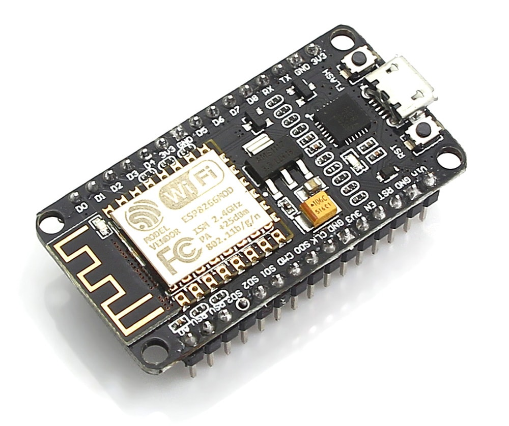
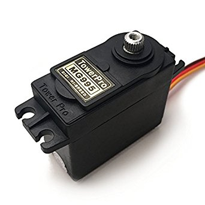

# smart-door
This is a simple project made with the nodeMCU,the aim is to control a door lock without keys,and using an IP to accomplish this,the communication medium will be the internet(wifi module-ESP8266).

### Version
1.0.0

### Connections:
nodeMCU -> servo MG995  

vin -> red  
GND -> brown
Pin5 -> yellow

## Hardware 

